# Solución a la prueba Club deportivo

Repositorio con el código solución a la prueba con la que se finaliza el módulo número 6 **Desarrollo de aplicaciones web con Node y Express** de la beca **Desarrollo de aplicaciones Full Stack Javascript Trainee** dictada por Desafío Latam

## Requisitos

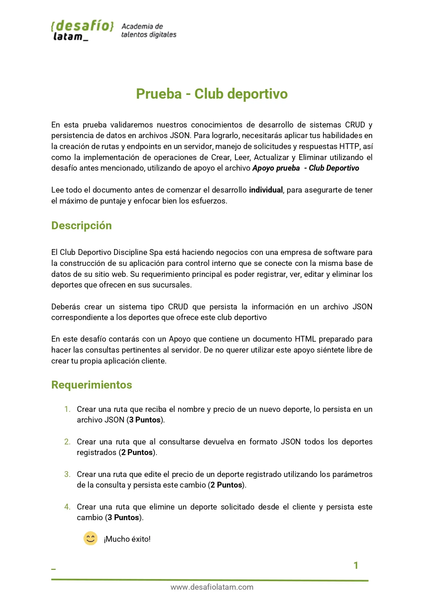

## Proyecto Finalizado: Diagrama de Flujo

A continuación muestro el diagrama de flujo del proyecto para mostrar su funcionalidad y cómo utilizarlo:

### 1-Página de Inicio

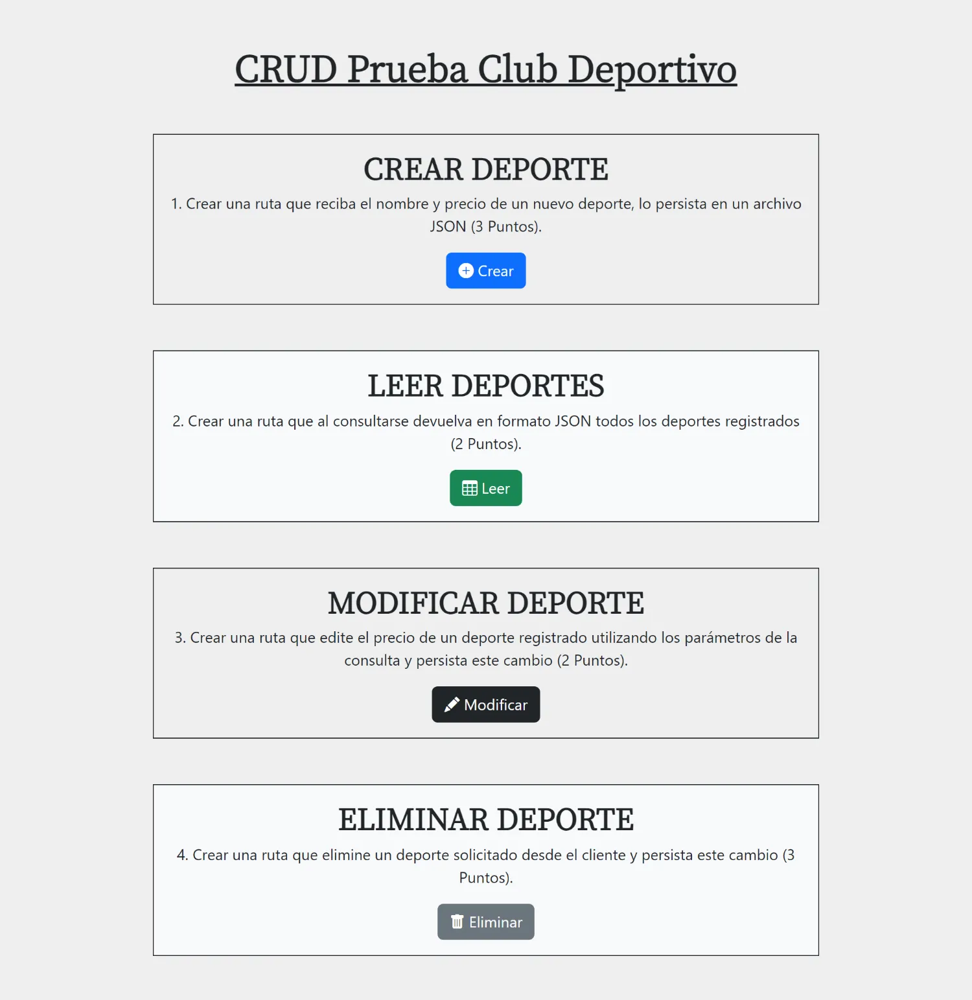

### 2- Página para crear,editar y eliminar deportes

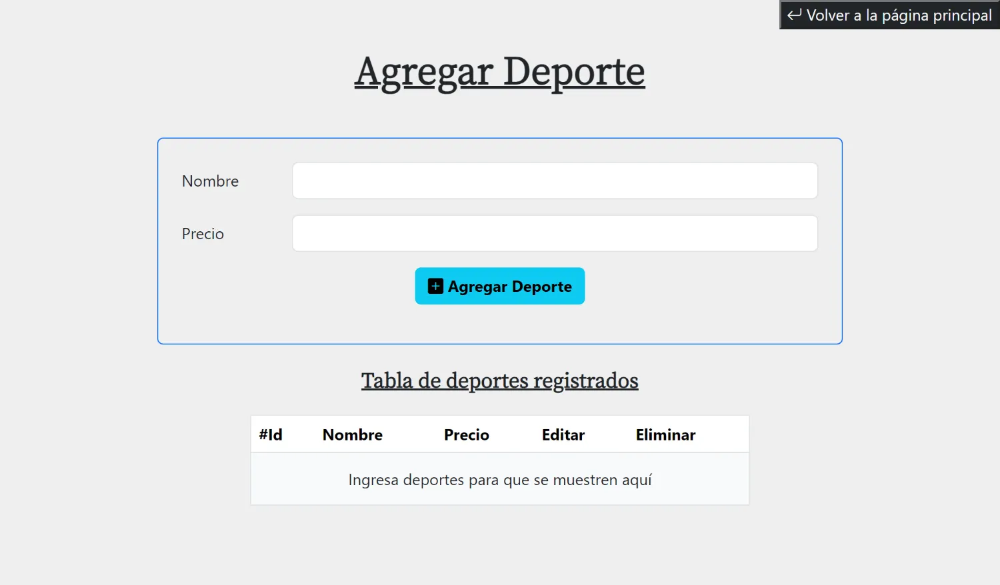

### 3- Página de lectura de datos sin datos

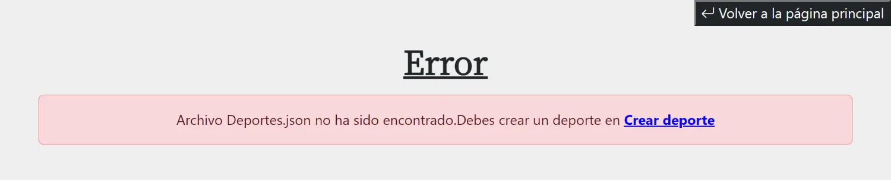

### 4- Ruta de edición sin parámetros

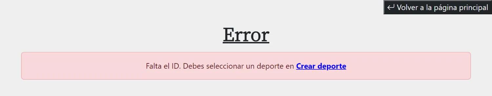

### 5- Ruta de edición con parámetro pero sin data

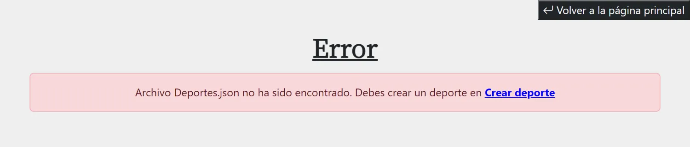

### 6- Ruta de eliminación sin parámetros

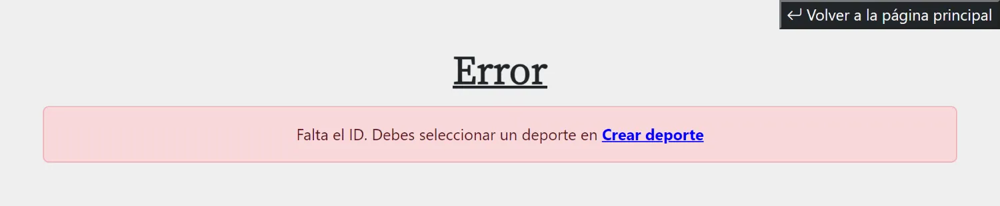

### 7- Ruta de eliminación con parámetro pero sin data


### 8- Creación de deporte exitosa


### 9- Lectura de deportes


### 10- Edición de deporte

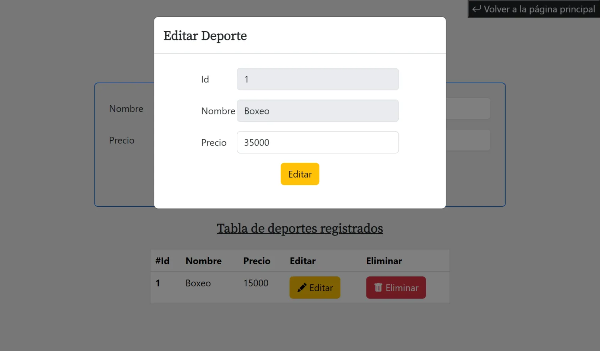

### 11-Edición de deporte exitosa

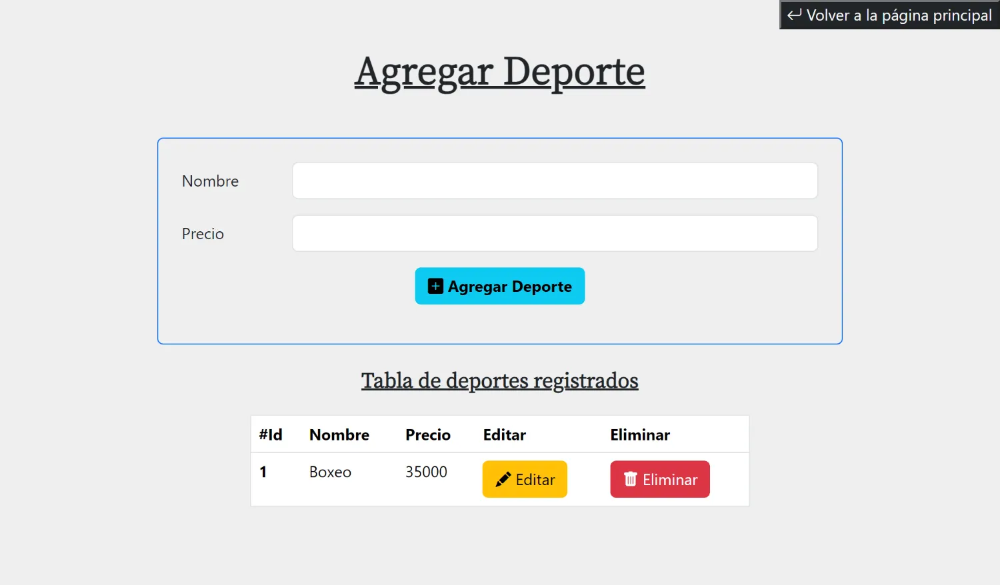

### 12-Lectura de deporte editado

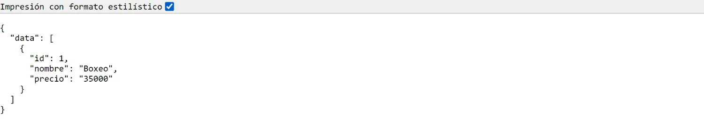

### 13-Eliminación de deporte exitosa

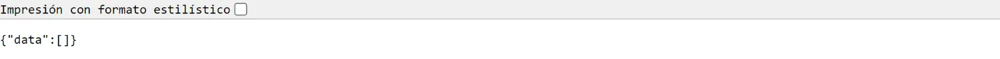

### 14-Ruta Desconocida

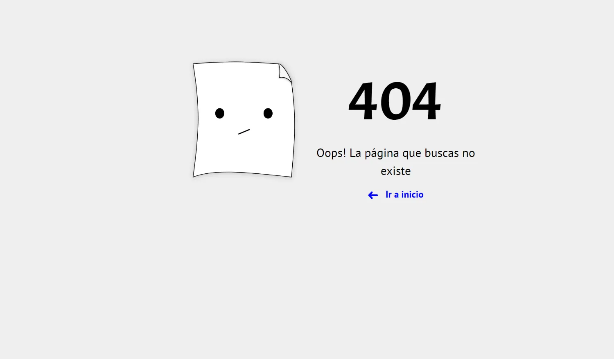

## Librerias utilizadas

| Tecnologías Utilizadas |
| ---------------------- |
| Express                |
| Express-handlebars     |
| Bootstrap              |
| JQuery                 |
| Axios                  |
| Bootstrap-icons        |

## Soluciones

### 1.Crear una ruta que reciba el nombre y precio de un nuevo deporte, lo persista en un archivo JSON (3 Puntos)

La ruta que he creado que procesa la creación de un nuevo deporte es la siguiente:

```js
router.get("/agregar_deporte", agregarDeporte);
```

El middleware utilizado es la función **agregarDeporte** siguiente:

```js
function agregarDeporte(req, res) {
  const deporte = { id: 1, nombre: req.query.nombre, precio: req.query.precio };

  fs.readFile("deportes.json", "utf-8", (err, data) => {
    if (err) {
      if (err.code === "ENOENT") {
        const objetoArchivo = JSON.stringify({ data: [deporte] });

        fs.writeFile("deportes.json", objetoArchivo, (err) => {
          if (err) {
            console.log(err);
          }
          res.redirect("/crear");
        });
      } else {
        console.log("Error desconocido:", err);
      }
    } else {
      const deportes = JSON.parse(data)["data"];
      const newDeporte = {
        id: deportes.length + 1,
        nombre: deporte.nombre,
        precio: deporte.precio,
      };

      deportes.push(newDeporte);
      fs.writeFile(
        "deportes.json",
        JSON.stringify({ data: deportes }),
        (err) => {
          if (err) {
            console.log(err);
          }
          res.redirect("/crear");
        }
      );
    }
  });
}
```

### 2.Crear una ruta que al consultarse devuelva en formato JSON todos los deportes registrados (2 Puntos)

La ruta que he creado para consultar los deportes creados es la siguiente:

```js
router.get("/leer", leerDeportes);
```

El middleware utilizado es la función **leerDeportes** siguiente:

```js
function leerDeportes(req, res) {
  fs.readFile("deportes.json", (err, data) => {
    if (err) {
      res.render("editar_error", {
        error:
          "Archivo Deportes.json no ha sido encontrado.Debes crear un deporte en <a href='/crear'>Crear deporte</a>",
      });
      return;
    }
    res.status(200).json(JSON.parse(data));
  });
}
```

### 3.Crear una ruta que edite el precio de un deporte registrado utilizando los parámetros de la consulta y persista este cambio (2 Puntos)

La ruta que he creado para editar el precio de un deporte es la siguiente:

```js
router.get("/editar", editarDeporte);
```

El middleware utilizado es la función **editarDeporte** siguiente:

```js
function editarDeporte(req, res) {
  const { id, precio } = req.query;
  if (!id) {
    res.render("editar_error", {
      error:
        "Falta el ID. Debes seleccionar un deporte en <a href='/crear'>Crear deporte</a>",
    });
    return;
  }
  fs.readFile("deportes.json", (err, data) => {
    if (err) {
      console.log(err);
      res.render("editar_error", {
        error:
          "Archivo Deportes.json no ha sido encontrado. Debes crear un deporte en <a href='/crear'>Crear deporte</a>",
      });
      return;
    }
    const deportes = JSON.parse(data)["data"];
    const deporte = deportes.find((d) => d.id == id);
    if (!deporte) {
      res.render("editar_error", {
        error: `Elemento de ${id} no encontrado. Debes seleccionar un deporte en <a href='/crear'>Crear deporte</a>`,
      });
      return;
    }
    if (!precio) {
      res.render("editar_error", {
        error:
          "Falta el precio. Debes ingresar un precio en <a href='/crear'>Crear deporte</a>",
      });
      return;
    }
    deporte.precio = precio;
    fs.writeFile("deportes.json", JSON.stringify({ data: deportes }), (err) => {
      if (err) {
        console.log(err);
      }
      res.status(200).send("Elemento de ID: " + id + " editado con éxito");
    });
  });
}
```

### 4.Crear una ruta que elimine un deporte solicitado desde el cliente y persista este cambio (3 Puntos)

La ruta que he creado para eliminar un deporte es la siguiente:

```js
router.get("/eliminar", eliminarDeporte);
```

El middleware utilizado es la función **eliminarDeporte** siguiente:

```js
function eliminarDeporte(req, res) {
  const { id } = req.query;

  if (!id) {
    res.render("editar_error", {
      error:
        "Falta el ID. Debes seleccionar un deporte en <a href='/crear'>Crear deporte</a>",
    });
    return;
  }
  fs.readFile("deportes.json", (err, data) => {
    if (err) {
      console.log(err);
      res.render("editar_error", {
        error:
          "Archivo Deportes.json no ha sido encontrado. Debes crear un deporte en <a href='/crear'>Crear deporte</a>",
      });
      return;
    }
    const deportes = JSON.parse(data)["data"];
    const deporte = deportes.find((d) => d.id == +id);
    const indiceElementoToDelete = deportes.indexOf(deporte);

    if (!deporte) {
      res.render("editar_error", {
        error: `Elemento de ${id} no encontrado. Debes seleccionar un deporte en <a href='/crear'>Crear deporte</a>`,
      });
      return;
    }
    deportes.splice(indiceElementoToDelete, 1);
    fs.writeFile("deportes.json", JSON.stringify({ data: deportes }), (err) => {
      if (err) {
        console.log(err);
      }
      res.status(200).send("Elemento de ID: " + id + " eliminado con exito");
    });
  });
}
```

### ¡¡EXTRA!!: Eliminación de archivo deportes.json cada 5 minutos

Cada 5 minutos se borra el archivo **deportes.json** y si no existe dicho archivo entonces se muestra en consola un mensaje de esta acción:

```js
function eliminarArchivosDeCarpeta() {
  const rutaArchivo = path.join(__dirname, "..", "deportes.json");
  fs.access(rutaArchivo, fs.constants.R_OK && fs.constants.W_OKs, (err) => {
    if (err) {
      console.error("No es posible acceder al archivo deportes.json");
    } else {
      fs.unlink(rutaArchivo, (err) => {
        if (err) {
          console.error("Error al eliminar el archivo:", err);
        } else {
          console.log("Archivo eliminado:", rutaArchivo);
        }
      });
    }
  });
}

setInterval(eliminarArchivosDeCarpeta, 5 * 60 * 1000);
```
